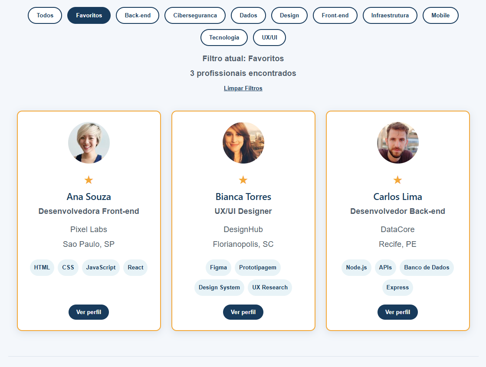

# TechJobs Brasil

> Conectando talentos de tecnologia às melhores oportunidades.

Uma aplicação web desenvolvida com **React + Vite** para listar profissionais de tecnologia em cards interativos, com busca, filtros por área, favoritos, resumo de dados e perfil expansível.

---

## Badges


---

## Demonstração

### Deploy Online

**Acesse o projeto:**

https://tech-jobs-brasil-gy7g.vercel.app/


### Screenshots

<h4>Tela Inicial</h4>

<p align="center">
  
</p>

<h4>Busca de Profissionais</h4>

<p align="center">
  
</p>

<h4>Filtro por Área</h4>

<p align="center">
  
</p>

<h4>Favoritos</h4>

<p align="center">
  
</p>

<h4>Visualização de Perfil</h4>

<p align="center">
  
</p>

## Sobre o Projeto

O TechJobs Brasil é um catálogo de profissionais de tecnologia criado para praticar os fundamentos do React através de uma aplicação organizada, componentizada e interativa.

O sistema permite visualizar profissionais cadastrados, pesquisar por nome ou habilidade, aplicar filtros por área, marcar favoritos e visualizar uma breve descrição de cada profissional.

O projeto foi desenvolvido com foco em:

* Componentização
* Gerenciamento de estado com React
* Manipulação de listas
* Filtros dinâmicos
* Renderização condicional
* Responsividade
* Boas práticas de organização de código

---

## Principais Funcionalidades

* Listagem de profissionais em cards
* Busca por nome
* Busca por habilidades
* Filtro por área
* Filtro exclusivo de favoritos
* Favoritar e remover favoritos
* Contador de resultados
* Resumo estatístico
* Ordenação alfabética
* Perfil expansível
* Limpeza rápida dos filtros
* Layout responsivo

---

## Tecnologias Utilizadas

| Tecnologia | Finalidade                  |
| ---------- | --------------------------- |
| React      | Construção da interface     |
| Vite       | Ambiente de desenvolvimento |
| JavaScript | Lógica da aplicação         |
| CSS3       | Estilização                 |
| HTML5      | Estrutura da aplicação      |
| ESLint     | Padronização do código      |
| Git        | Controle de versão          |
| GitHub     | Hospedagem do código        |
| Vercel     | Deploy da aplicação         |

---

## Arquitetura do Projeto

### Estrutura de Pastas

```bash
TechJobs-_Brasil/
├── DOCUMENTACAO_TECHJOBS_BRASIL.txt
└── techjobs-brasil/
    ├── package.json
    ├── src/
    │
    ├── App.jsx
    ├── App.css
    │
    ├── data/
    │   └── profissionais.js
    │
    └── components/
        ├── Cabecalho.jsx
        ├── Resumo.jsx
        ├── CampoBusca.jsx
        ├── FiltroArea.jsx
        ├── ListaProfissionais.jsx
        ├── CardProfissional.jsx
        └── Rodape.jsx
```

### Fluxo da Aplicação

```text
Dados dos Profissionais
          ↓
       App.jsx
          ↓
 Estados e Filtros
          ↓
 Componentes
          ↓
 Interface do Usuário
```

### Organização do Código

#### App.jsx

Responsável por:

* Gerenciamento dos estados
* Busca
* Filtros
* Favoritos
* Ordenação
* Integração entre componentes

#### data/profissionais.js

Responsável por:

* Armazenar os dados dos profissionais

#### components/

Responsável pela separação da interface em componentes reutilizáveis.

---

## Instalação

Clone o repositório:

```bash
git clone https://github.com/Jorgeelric/TechJobs-_Brasil.git
```

Entre na pasta do projeto:

```bash
cd TechJobs-_Brasil/techjobs-brasil
```

Instale as dependências:

```bash
npm install
```

---

## Como Executar

### Ambiente de Desenvolvimento

```bash
npm run dev
```

### Build de Produção

```bash
npm run build
```

### Visualizar Build

```bash
npm run preview
```

### Executar Lint

```bash
npm run lint
```

---

## Roadmap

### Próximas Melhorias

* [ ] Persistência de favoritos com Local Storage
* [ ] Integração com API real
* [ ] Página individual do profissional
* [ ] Sistema de paginação
* [ ] Dark Mode
* [ ] Busca avançada
* [ ] Filtro por cidade
* [ ] Filtro por empresa
* [ ] Testes automatizados
* [ ] Migração para TypeScript
* [ ] Deploy automatizado com GitHub Actions

---

## Contribuição

Contribuições são sempre bem-vindas.

### Passos para contribuir

```bash
# Faça um Fork

# Crie uma branch
git checkout -b feature/minha-feature

# Faça suas alterações

# Commit
git commit -m "feat: adiciona nova funcionalidade"

# Push
git push origin feature/minha-feature
```

Depois disso, abra um Pull Request.

---

## Autor

**Jorge Gàlddino**

Estudante e praticante de  desenvolvimento Front-End.

### Contato

GitHub:

https://github.com/Jorgeelric

LinkedIn:

www.linkedin.com/in/jorge-galdino

---

## Licença

Este projeto ainda não possui uma licença definida.

Caso deseje disponibilizar o código para uso da comunidade, recomenda-se a utilização da licença MIT.

---

## Apoie o Projeto

Se este projeto foi útil para você:

* Deixe uma estrela no repositório
* Compartilhe com outros desenvolvedores
* Contribua com melhorias

Seu apoio ajuda na evolução contínua do projeto.
